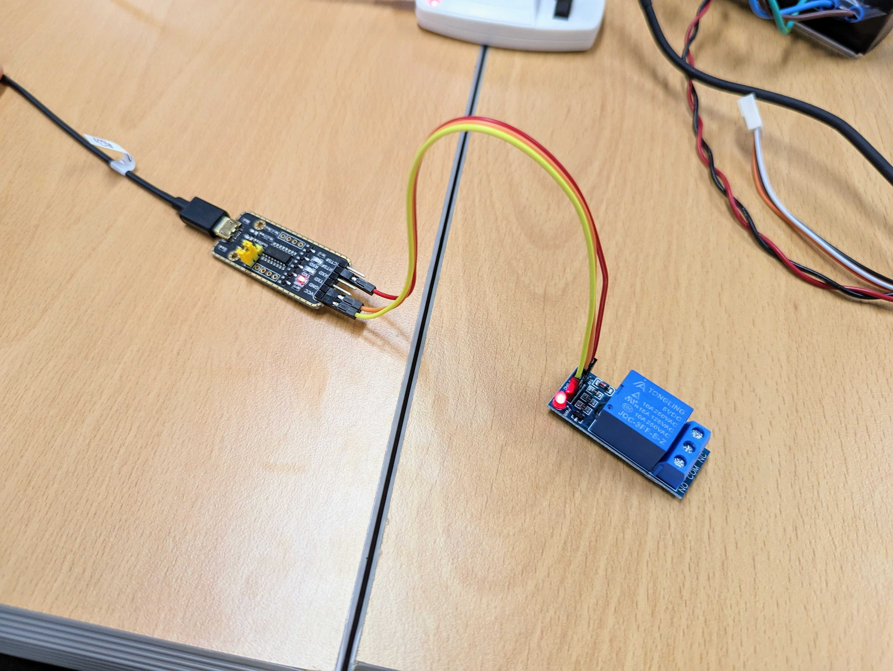

# uart-relay-switch
Get your own remote switch with command-line interface, to press your board's reset button programmatically!



A relay is an switch that operated by electricity. So we need a GPIO to control relay programmatically.

However, there is no GPIO interface in most PCs. Instead, we have a USB to UART controller that can emulates GPIO.

We can't control the state(HIGH/LOW) of the TX/RX manually. But `RTS`, Request To Send, is a software-controlled pin that could be used as a GPIO controls relay.

## Prerequisites
* 1x USB to UART(TTL) serial converter
* 1x relay
* few jumper wires

## Wiring

```
                                  USB to UART
                                   converter
                          ┌─────────────────────────┐
                          │                     VCC ├──────────┐
   ┌────────────────┐     │        voltage          │          │        RELAY
   │                │     │        selector     GND ├───────┐  │  ┌───────────────┐          RESET
   │            ┌───┤     ├───┐                     │       │  └──┤ SIG        NO ├───x      SWITCH
   │            │ U │     │ U │      3V3        TXD ├───x   │     │               │       ┌──────────┐
   │      PC    │ S │=====│ S │    ┌─────┐          │       └─────┤ GND       COM ├───────┤          │
   │            │ B │     │ B │    │ VCC │      RXD ├───x         │               │       │          │
   │            └───┤     ├───┘    │     │          │       ┌─────┤ VCC        NC ├───────┤          │
   │                │     │        │ 5V  │      RTS ├───────┘     └───────────────┘       └──────────┘
   └────────────────┘     │        └─────┘          │
                          │                     CTS ├───x
                          └─────────────────────────┘
```

* Note that VCC/RTS could be swapped (`VCC-SIG / RTS-VCC` and `VCC-VCC / RTS-SIG` are all possible).

## Build
Implement your own switch logic in *main.c* and compile it with *relay.c*.

```sh
gcc relay.c main.c -o switch
gcc relay.c examples/push_return.c -o switch # example
```

Then put the executable to somewhere in `PATH`.

## Usage
```bash
./switch /dev/<your_uart_converter>
./switch /dev/cu.usbmodem51850106861 # example
```

## Examples
* **example/push_return.c**: simple push-return(tact) switch press implementation (ex. T2080RDB reset button)
* **example/push_toggle.c**: push-toggle switch on&off implementation (ex. IMA-FCC-T2080 power switch)
