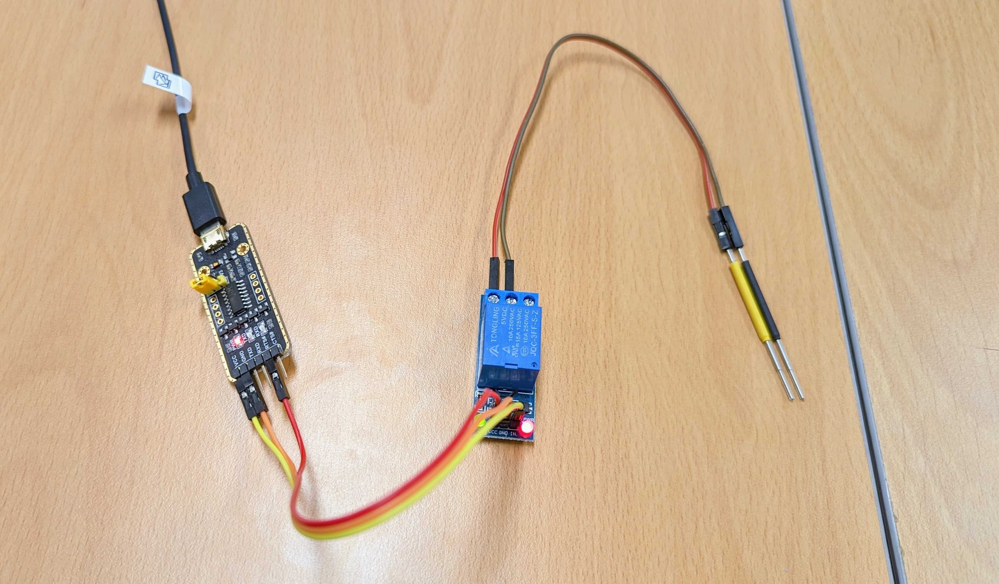

# uart-relay-switch
Press a reset button or recycle the power of your board programmatically, with command-line interface remote switch!



A relay is an switch that operated by electricity. It could be controlled by a GPIO signal.

However, there is no GPIO available in most PCs. Instead, we have a USB to UART controller that can emulate one GPIO pin.

We can't control the state of the TX/RX manually. But `RTS`, *Request To Send*, is a software-controlled pin that could be used as a GPIO.

## Prerequisites
* 1x [USB to UART(TTL) converter](https://www.eleparts.co.kr/goods/view?no=11328429)
* 1x [5V relay](https://www.eleparts.co.kr/goods/view?no=12834424)
* a few jumper wires

## Wiring

```
                                  USB to UART
                                   converter
                          ┌─────────────────────────┐
                          │                     VCC ├──────────┐
   ┌────────────────┐     │        voltage          │          │        RELAY
   │                │     │        selector     GND ├───────┐  │  ┌───────────────┐          RESET
   │            ┌───┤     ├───┐                     │       │  └──┤ VCC        NO ├───x      SWITCH
   │            │ U │     │ U │      3V3        TXD ├───x   │     │               │       ┌──────────┐
   │      PC    │ S │=====│ S │    ┌─────┐          │       └─────┤ GND       COM ├───────┤          │
   │            │ B │     │ B │    │ VCC │      RXD ├───x         │               │       │          │
   │            └───┤     ├───┘    │     │          │       ┌─────┤ SIG        NC ├───────┤          │
   │                │     │        │ 5V  │      RTS ├───────┘     └───────────────┘       └──────────┘
   └────────────────┘     │        └─────┘          │
                          │                     CTS ├───x
                          └─────────────────────────┘
```

### Note
* To correctly power up the relay, the voltage selector at the UART converter must be set to 5V.
* Since the state of the RTS pin is HIGH when idle, the relay will kept turned on. It will turned off only when the `ON()` function is called. This is why the switch is connected to the `NC` terminal instead of `NO`.
    * Relay's `NO` and `NC` terminals are *Normally Open* and *Normally Close*.

## Build
Implement your own switch logic in *main.c* and compile it with *relay.c*.

```sh
gcc relay.c main.c -o switch
gcc relay.c examples/push_return.c -o push-return # example
```

Then put the executable to somewhere in `PATH`.

## Usage
```bash
./switch /dev/<your_uart_converter>
./push-return /dev/cu.usbmodem51850106861 # example
```

* `ON(ms)` connects, and `OFF(ms)` disconnects the `COM` and the `NC` terminal of the relay electrically, for the duration of `ms`.

## Examples
* **example/push_return.c**: simple push-return(tact) switch press (ex. T2080RDB reset button)
* **example/push_toggle.c**: push-toggle switch on&off (ex. IMA-FCC-T2080 power switch)